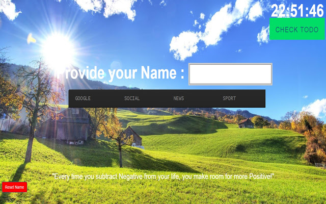
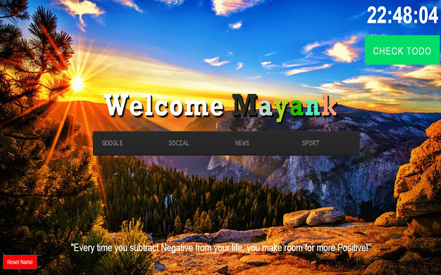
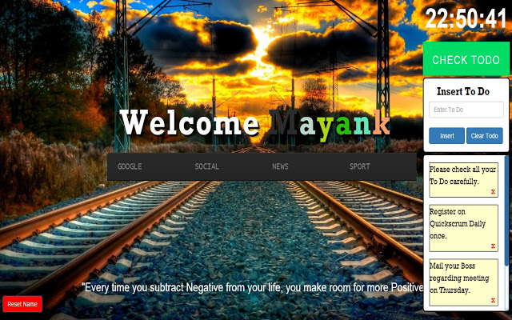
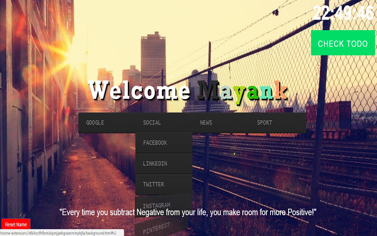

# CoolTab - Chrome new tab extension. 

It replaces new tab page with a personal dashboard featuring notes, thoughts, time,etc. Make your each tab special with new images. Make your each tab pro.

Made with HTML, CSS, Javascript, jQuery, Bootstrap

# Support

If this helps you, you can make my day by contributing to this project:

### [💜 Support my open-source work on GitHub](https://github.com/sponsors/mayank091193)

Please check out my sponsor page.

(GitHub currently **doubles your support**! So if you support me with $5/mo, I will get $10 instead! 😉)

Thank you very much!!

## Built using

* [HTML](https://www.w3schools.com/html/)
* [CSS](https://www.w3schools.com/css/)
* [Javascript](https://www.w3schools.com/js/)
* [jQuery](https://jquery.com/)
* [Bootstrap](https://getbootstrap.com/)

## Features

* On each new tab - new image
* Weather
* Day wishes
* Time
* To Do

## Published on Chrome Web Store

[CoolTab](https://chrome.google.com/webstore/detail/cooltab/lladajimgjkpmglaimjddnljcjekehan?h1=en)

## How to run on local?

```
git clone https://github.com/mayank091193/CoolTab.git
```

Visit ```chrome://extensions/```

Enable Developer mode if not enabled.

Click Load Unpacked(On top left or top right) and select the cloned folder(CoolTab) - This will add CoolTab local extension to the Chrome.


## Screens UI








